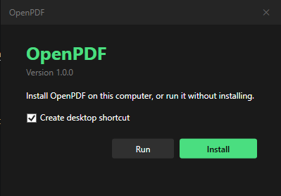
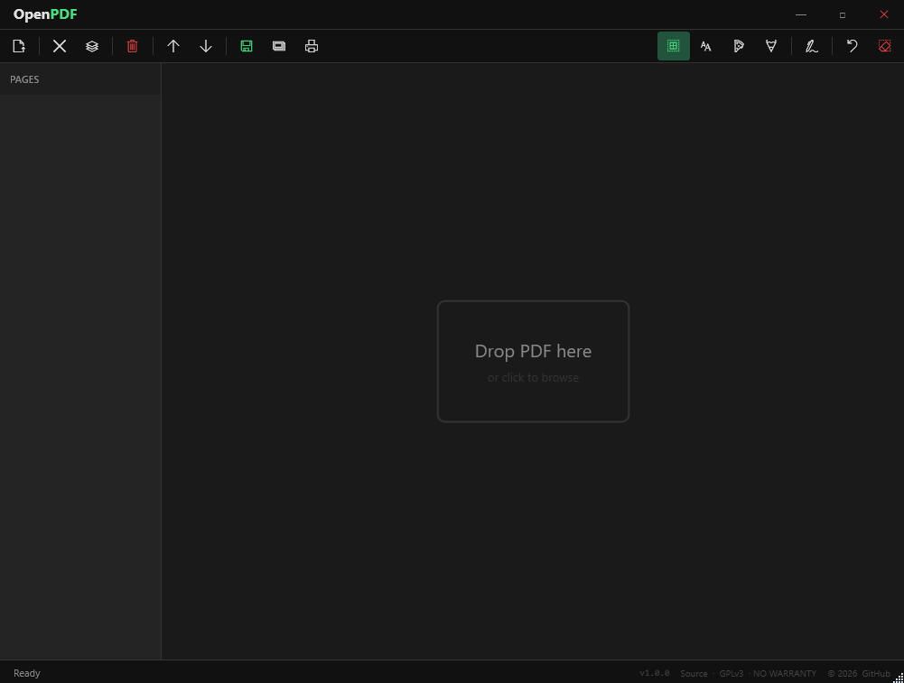
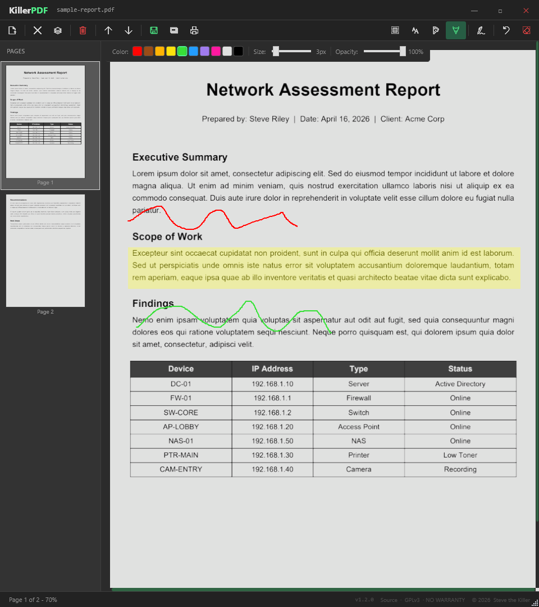

# OpenPDF


PDF editor. View, annotate, merge, split, edit text, draw, sign, print, flatten, and open password-protected PDFs without an Adobe subscription or a phone-home. Install or run portable. Single Windows EXE, ~6 MB zipped, no runtime install required.

Forked from v1.2.0 of [KillerPDF] (https://github.com/SteveTheKiller/KillerPDF), GPLv3 license.

## Features

- High-quality rendering via PDFium (Docnet.Core)
- Merge multiple PDFs and split out selected pages, drag-and-drop page reordering
- Inline text editing with font matching against the original document
- Text boxes, freehand drawing, and highlight overlays with adjustable color, size, and opacity
- Draw and save reusable signatures, click to place anywhere on a page
- Full-text search with result highlighting, drag-select to copy text
- Print with annotations flattened into the output
- Save Flattened PDF: rasterizes every page at 150 DPI via PDFium into a fully uneditable document
- Password-protected PDF support: prompts for password instead of erroring, decrypted copy held in temp for the session
- Self-installing EXE: Install or Run dialog on first launch, installs per-user to %LOCALAPPDATA% (no UAC), registers as PDF file handler, adds Start Menu shortcut, self-uninstalls cleanly

## Screenshots







## Requirements

- Windows 10 or 11 (x64)
- No runtime install. Everything needed is inside the EXE (targets .NET Framework 4.8, which ships with every supported Windows release).

## Build from source

```powershell
dotnet build OpenPDF.sln
dotnet publish OpenPDF.csproj -c Release -p:PublishProfile=FolderProfile
```

Output lands in `bin/Release/net48/publish/`. The publish step produces a single Costura-bundled `OpenPDF.exe` plus a versioned `OpenPDF-<version>-src.zip` for GPL3 source distribution.

Requires the .NET 8 SDK or later to build (even though the output targets .NET Framework 4.8).

## Changelog

See [CHANGELOG.md](CHANGELOG.md).

## Why this exists

I hate Adobe. Acrobat is bloated, tries to hijack file associations, wants a subscription to do basic things, and phones home constantly. Most of the "free" alternatives are either ad-riddled, cloud-based, or rebrands of the same PDF engine sold under three different names.

OpenPDF is what I wanted: local-only, portable, no account, no telemetry. The PDF equivalent of Notepad.

## License

GPLv3. See [LICENSE](LICENSE). If you fork, modify, or redistribute OpenPDF, your version must also be released under GPLv3 with source available. No exceptions for commercial rebrands.
